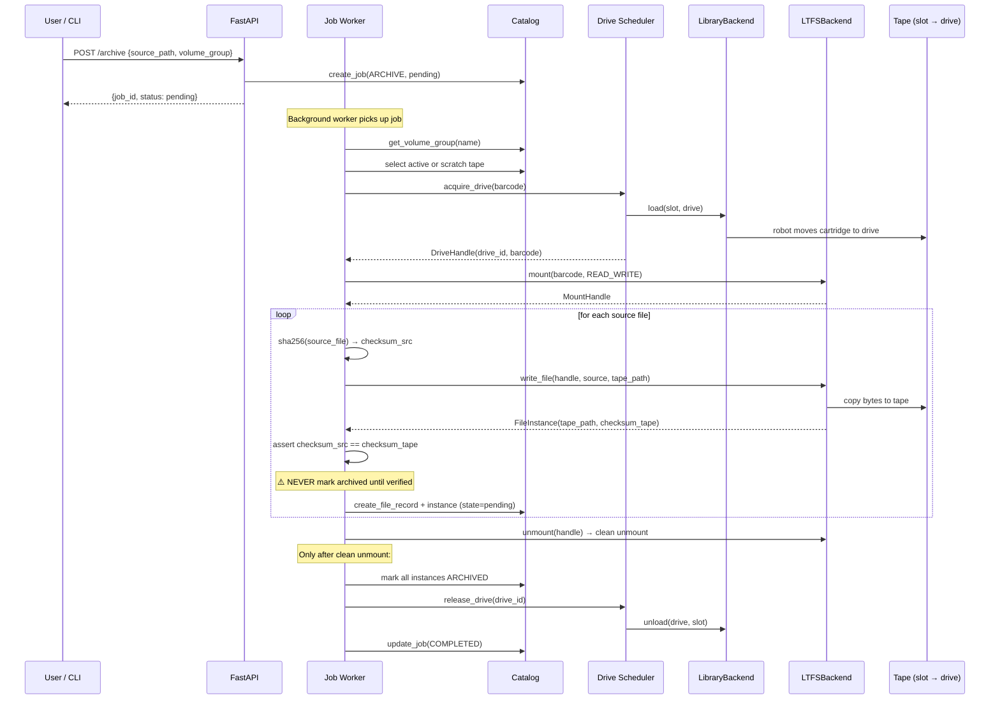
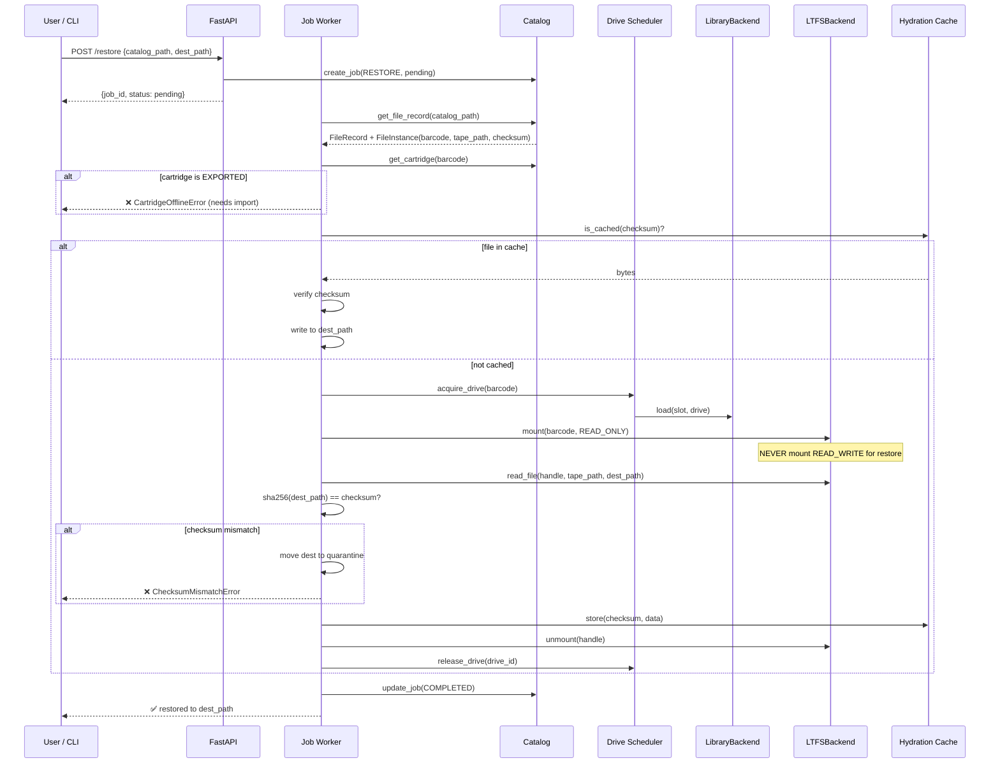
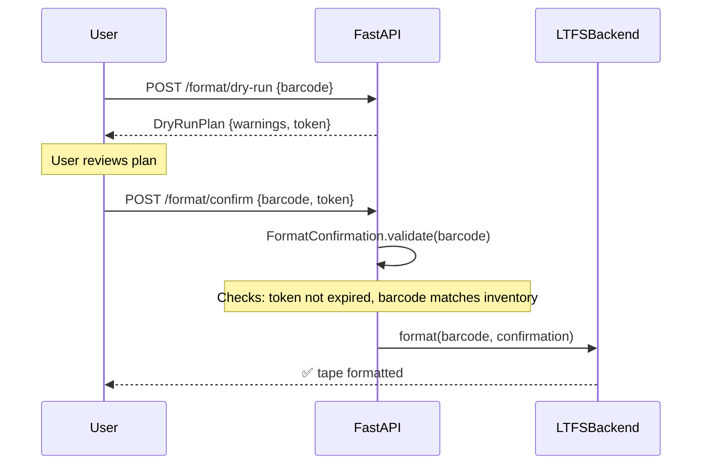
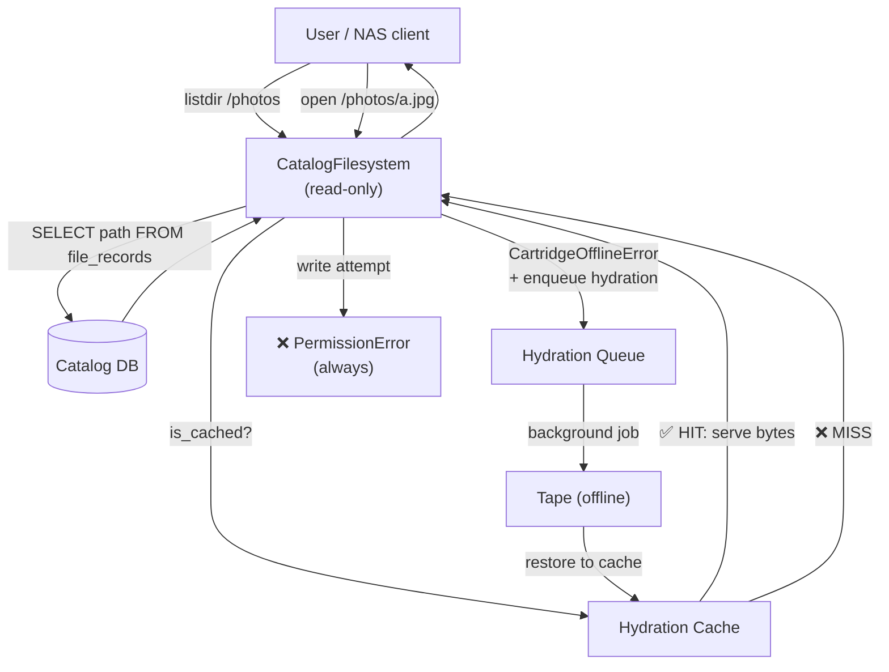

# OpenBlade — Data Flow Diagrams

## Archive Flow (single tape)

```mermaid
sequenceDiagram
    participant U as User / CLI
    participant API as FastAPI
    participant W as Job Worker
    participant CAT as Catalog
    participant SCHED as Drive Scheduler
    participant LIB as LibraryBackend
    participant LTFS as LTFSBackend
    participant TAPE as Tape (slot → drive)

    U->>API: POST /archive {source_path, volume_group}
    API->>CAT: create_job(ARCHIVE, pending)
    API-->>U: {job_id, status: pending}

    Note over W: Background worker picks up job

    W->>CAT: get_volume_group(name)
    W->>CAT: select active or scratch tape
    W->>SCHED: acquire_drive(barcode)
    SCHED->>LIB: load(slot, drive)
    LIB->>TAPE: robot moves cartridge to drive
    SCHED-->>W: DriveHandle(drive_id, barcode)

    W->>LTFS: mount(barcode, READ_WRITE)
    LTFS-->>W: MountHandle

    loop for each source file
        W->>W: sha256(source_file) → checksum_src
        W->>LTFS: write_file(handle, source, tape_path)
        LTFS->>TAPE: copy bytes to tape
        LTFS-->>W: FileInstance(tape_path, checksum_tape)
        W->>W: assert checksum_src == checksum_tape
        Note over W: ⚠️ NEVER mark archived until verified
        W->>CAT: create_file_record + instance (state=pending)
    end

    W->>LTFS: unmount(handle) → clean unmount
    Note over W: Only after clean unmount:
    W->>CAT: mark all instances ARCHIVED

    W->>SCHED: release_drive(drive_id)
    SCHED->>LIB: unload(drive, slot)
    W->>CAT: update_job(COMPLETED)
```

## Restore Flow (single tape)

```mermaid
sequenceDiagram
    participant U as User / CLI
    participant API as FastAPI
    participant W as Job Worker
    participant CAT as Catalog
    participant SCHED as Drive Scheduler
    participant LIB as LibraryBackend
    participant LTFS as LTFSBackend
    participant CACHE as Hydration Cache

    U->>API: POST /restore {catalog_path, dest_path}
    API->>CAT: create_job(RESTORE, pending)
    API-->>U: {job_id, status: pending}

    W->>CAT: get_file_record(catalog_path)
    CAT-->>W: FileRecord + FileInstance(barcode, tape_path, checksum)

    W->>CAT: get_cartridge(barcode)
    alt cartridge is EXPORTED
        W-->>U: ❌ CartridgeOfflineError (needs import)
    end

    W->>CACHE: is_cached(checksum)?
    alt file in cache
        CACHE-->>W: bytes
        W->>W: verify checksum
        W->>W: write to dest_path
    else not cached
        W->>SCHED: acquire_drive(barcode)
        SCHED->>LIB: load(slot, drive)
        W->>LTFS: mount(barcode, READ_ONLY)
        Note over LTFS: NEVER mount READ_WRITE for restore
        W->>LTFS: read_file(handle, tape_path, dest_path)
        W->>W: sha256(dest_path) == checksum?
        alt checksum mismatch
            W->>W: move dest to quarantine
            W-->>U: ❌ ChecksumMismatchError
        end
        W->>CACHE: store(checksum, data)
        W->>LTFS: unmount(handle)
        W->>SCHED: release_drive(drive_id)
    end

    W->>CAT: update_job(COMPLETED)
    W-->>U: ✅ restored to dest_path
```

## Format Flow (requires dry-run first)

```mermaid
sequenceDiagram
    participant U as User
    participant API as FastAPI
    participant LTFS as LTFSBackend

    U->>API: POST /format/dry-run {barcode}
    API-->>U: DryRunPlan {warnings, token}

    Note over U: User reviews plan

    U->>API: POST /format/confirm {barcode, token}
    API->>API: FormatConfirmation.validate(barcode)
    Note over API: Checks: token not expired, barcode matches inventory
    API->>LTFS: format(barcode, confirmation)
    LTFS-->>U: ✅ tape formatted
```

## Virtual Filesystem (FUSE) Access

```mermaid
graph TD
    USER["User / NAS client"]
    FUSE["CatalogFilesystem\n(read-only)"]
    CAT[("Catalog DB")]
    CACHE["Hydration Cache"]
    HYDQ["Hydration Queue"]
    TAPE["Tape (offline)"]

    USER -->|listdir /photos| FUSE
    FUSE -->|SELECT path FROM file_records| CAT
    CAT --> FUSE
    FUSE --> USER

    USER -->|open /photos/a.jpg| FUSE
    FUSE -->|is_cached?| CACHE
    CACHE -->|✅ HIT: serve bytes| FUSE
    CACHE -->|❌ MISS| FUSE
    FUSE -->|CartridgeOfflineError\n+ enqueue hydration| HYDQ
    HYDQ -->|background job| TAPE
    TAPE -->|restore to cache| CACHE

    FUSE -->|write attempt| ERR["❌ PermissionError\n(always)"]
```
