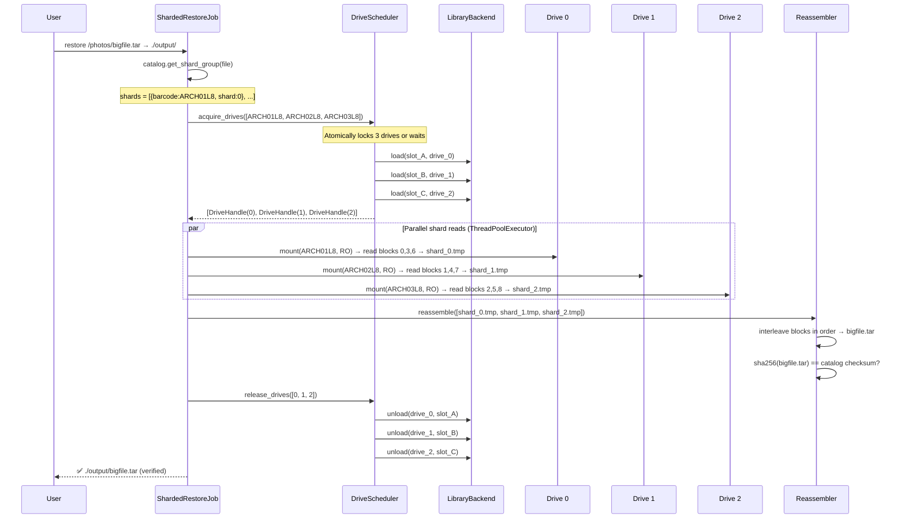
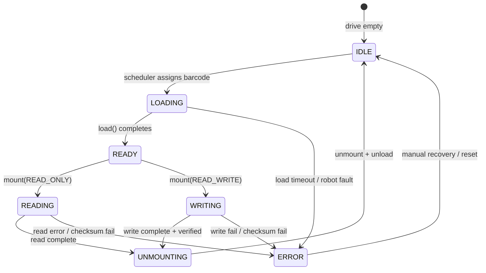
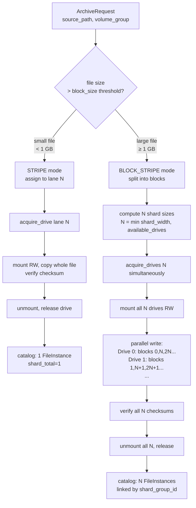

# OpenBlade — Parallel Tape Sharding Design

## Problem

A single tape drive is the bottleneck for both archive and restore throughput. A Quantum Scalar i3 can have up to 6 LTO-8 drives (300 MB/s each), but naive single-stream jobs use only one at a time.

**Goal:** When N drives are available, read (and write) N tape streams simultaneously.

---

## Sharding Modes

### Mode 1: `STRIPE` — File-level round-robin (default)

Files are assigned to tape *lanes* round-robin. Each file lives on exactly one tape. Multiple concurrent restore jobs each get their own drive.

```
VolumeGroup "photos" — shard_width=3, mode=STRIPE

Lane 0 → PHOTO01L8   Lane 1 → PHOTO02L8   Lane 2 → PHOTO03L8
┌──────────────┐      ┌──────────────┐      ┌──────────────┐
│ a.jpg        │      │ b.jpg        │      │ c.jpg        │
│ d.jpg        │      │ e.jpg        │      │ f.jpg        │
│ g.jpg        │      │ h.jpg        │      │ i.jpg        │
└──────────────┘      └──────────────┘      └──────────────┘

Restore [a.jpg, b.jpg, c.jpg]:
  Drive 0 ← PHOTO01L8  →  reads a.jpg  ─┐
  Drive 1 ← PHOTO02L8  →  reads b.jpg  ─┼→ parallel, 3× throughput
  Drive 2 ← PHOTO03L8  →  reads c.jpg  ─┘
```

**Best for:** Many small-to-medium files, independent restore requests.  
**Requirement:** Number of concurrent restore jobs ≤ number of drives.

---

### Mode 2: `BLOCK_STRIPE` — Block-level striping of single files

A large file is split into fixed-size blocks (default 1 GB). Blocks are distributed round-robin across N tapes. Restoring the file requires all N drives simultaneously.

```
VolumeGroup "archive" — shard_width=3, block_size=1 GB, mode=BLOCK_STRIPE

bigfile.tar (9 GB):
  Block 0 (0–1 GB)   → ARCH01L8 at /shards/bigfile.tar/000
  Block 1 (1–2 GB)   → ARCH02L8 at /shards/bigfile.tar/001
  Block 2 (2–3 GB)   → ARCH03L8 at /shards/bigfile.tar/002
  Block 3 (3–4 GB)   → ARCH01L8 at /shards/bigfile.tar/003
  Block 4 (4–5 GB)   → ARCH02L8 at /shards/bigfile.tar/004
  ...

Restore:
  Drive 0 ← ARCH01L8  →  blocks 0, 3, 6  ─┐
  Drive 1 ← ARCH02L8  →  blocks 1, 4, 7  ─┼→ interleaved parallel read → reassemble
  Drive 2 ← ARCH03L8  →  blocks 2, 5, 8  ─┘
```

**Best for:** Very large single files (multi-TB archives), maximum throughput.  
**Requirement:** All N shard tapes must be loaded simultaneously.

---

### Mode 3: `ERASURE` — k-of-(k+m) erasure coding *(future v0.3)*

Split into k data shards + m parity shards. Any k of the k+m shards can reconstruct the file. Tolerates m drive/tape failures.

```
k=4 data shards, m=2 parity shards → 6 tapes total
Can restore with any 4 of the 6 tapes/drives
```

Not implemented yet — requires Reed-Solomon library (e.g., `zfec`).

---

## Shard Manifest in Catalog

Each sharded file gets a `shard_group_id` linking all its `FileInstance` rows:

```
file_records
  id=abc  path=/photos/bigfile.tar  size=9GB  checksum=sha256:...

file_instances
  id=i0  file_record_id=abc  barcode=ARCH01L8  tape_path=/shards/bigfile.tar/000
         shard_group_id=grp1  shard_index=0  shard_total=3  block_start=0       block_end=1073741824
  id=i1  file_record_id=abc  barcode=ARCH02L8  tape_path=/shards/bigfile.tar/001
         shard_group_id=grp1  shard_index=1  shard_total=3  block_start=1073741824  block_end=2147483648
  id=i2  file_record_id=abc  barcode=ARCH03L8  tape_path=/shards/bigfile.tar/002
         shard_group_id=grp1  shard_index=2  shard_total=3  block_start=2147483648  block_end=3221225472
  ...
```

---

## Parallel Restore Flow (N drives)



---

## Drive Scheduler State Machine



---

## Drive Allocation Algorithm

```
DriveScheduler.acquire_drives(barcodes: list[str]) → list[DriveHandle]

1. Check len(barcodes) ≤ available_drive_count
   → else: wait on condition variable until drives free

2. For each barcode, check not already in a drive (conflict check)
   → if barcode already loaded in drive N: reuse drive N (deduplicated)
   → else: pick next free drive from pool

3. Atomically mark all selected drives as LOCKED(barcode)
   → no other job can steal a drive mid-allocation

4. Return DriveHandle list in same order as barcodes

5. On release: mark drives as IDLE, signal waiting jobs
```

---

## Throughput Model

| Config | Drives | Mode | Theoretical Max |
|--------|--------|------|-----------------|
| Baseline | 1 | NONE | 300 MB/s |
| 2-drive stripe | 2 | STRIPE | 600 MB/s |
| 4-drive block stripe | 4 | BLOCK_STRIPE | 1.2 GB/s |
| 6-drive block stripe | 6 | BLOCK_STRIPE | 1.8 GB/s |
| 4+2 erasure (future) | 4 of 6 | ERASURE | ~1.2 GB/s + fault tolerance |

*LTO-8 native: 300 MB/s. Compressed: up to 750 MB/s (2.5:1 ratio on compressible data).*

---

## Lane Assignment Algorithm (STRIPE mode)

```
assign_lane(file_record, volume_group) → barcode

lane_index = hash(file_record.path) % volume_group.shard_width
barcode    = volume_group.lanes[lane_index]

Properties:
  - Deterministic: same file always on same lane (stable re-archive)
  - Even distribution: hash distributes uniformly across lanes
  - No coordination needed: workers can assign independently
```

For rebalancing (when a tape fills up):
```
overflow_barcode = volume_group.scratch_tapes.pop()
volume_group.add_lane(overflow_barcode)
# New shard_width = old + 1
# Existing files keep their lane (immutable assignment)
# New files assigned to expanded lane set
```

---

## Shard-Aware Archive Flow



---

## Failure Handling

| Failure | During STRIPE | During BLOCK_STRIPE |
|---------|--------------|-------------------|
| Drive load fails | Retry with next free drive | Abort all shards, mark job FAILED_RECOVERABLE |
| Write fails mid-file | Mark instance FAILED, tape may be dirty | Abort all shards, partial blocks marked FAILED |
| Checksum mismatch | Mark instance FAILED, do not mark archived | Abort reassembly, quarantine partial output |
| Drive fails during read | Fall back to non-sharded restore from another instance | Requires at least k shards healthy (erasure mode) |
| Partial shard recovery | N/A (file on one tape) | Repair job: rewrite only failed shard to new tape |
