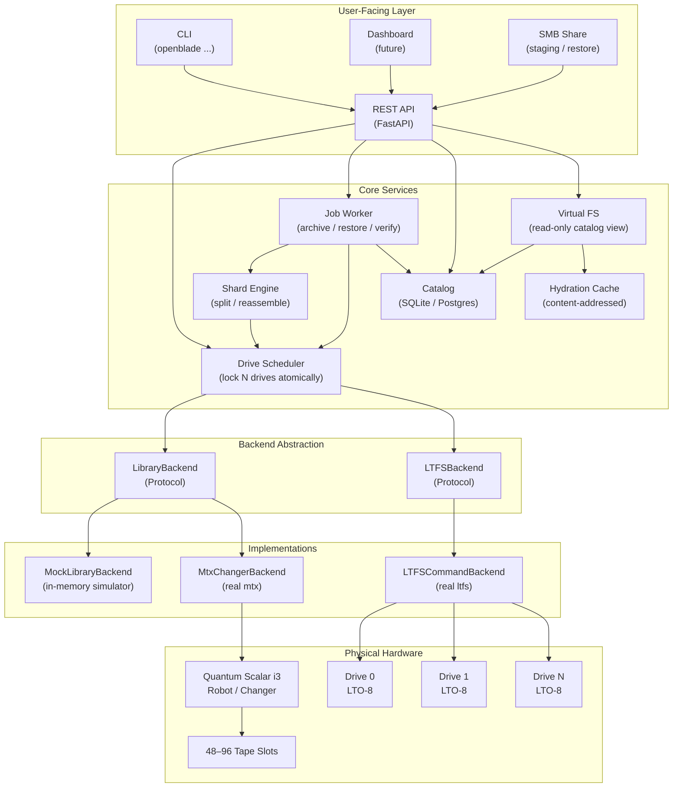
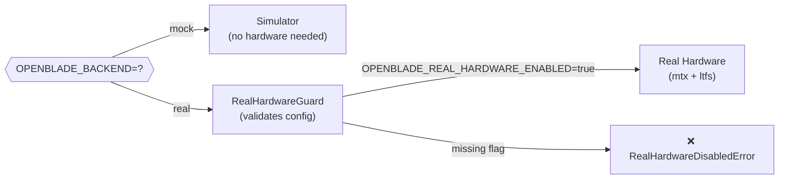
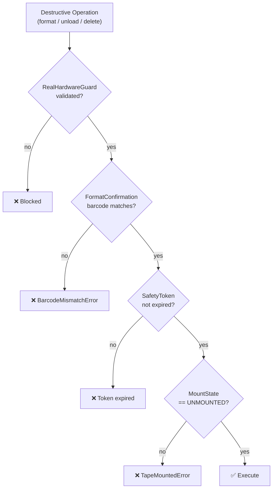

# OpenBlade — System Architecture

## Component Overview

```mermaid
graph TB
    subgraph User["User-Facing Layer"]
        CLI["CLI\n(openblade ...)"]
        API["REST API\n(FastAPI)"]
        DASH["Dashboard\n(future)"]
        SMB["SMB Share\n(staging / restore)"]
    end

    subgraph Core["Core Services"]
        SCHED["Drive Scheduler\n(lock N drives atomically)"]
        WORKER["Job Worker\n(archive / restore / verify)"]
        SHARD["Shard Engine\n(split / reassemble)"]
        CAT["Catalog\n(SQLite / Postgres)"]
        FUSE["Virtual FS\n(read-only catalog view)"]
        HYDRATE["Hydration Cache\n(content-addressed)"]
    end

    subgraph Backend["Backend Abstraction"]
        LIB["LibraryBackend\n(Protocol)"]
        LTFS["LTFSBackend\n(Protocol)"]
    end

    subgraph Impl["Implementations"]
        MOCK["MockLibraryBackend\n(in-memory simulator)"]
        REAL_LIB["MtxChangerBackend\n(real mtx)"]
        REAL_LTFS["LTFSCommandBackend\n(real ltfs)"]
    end

    subgraph Hardware["Physical Hardware"]
        ROBOT["Quantum Scalar i3\nRobot / Changer"]
        D0["Drive 0\nLTO-8"]
        D1["Drive 1\nLTO-8"]
        DN["Drive N\nLTO-8"]
        SLOTS["48–96 Tape Slots"]
    end

    CLI --> API
    DASH --> API
    SMB --> API
    API --> SCHED
    API --> WORKER
    API --> CAT
    API --> FUSE
    WORKER --> SHARD
    WORKER --> SCHED
    SHARD --> SCHED
    SCHED --> LIB
    SCHED --> LTFS
    WORKER --> CAT
    FUSE --> CAT
    FUSE --> HYDRATE
    LIB --> MOCK
    LIB --> REAL_LIB
    LTFS --> REAL_LTFS
    REAL_LIB --> ROBOT
    REAL_LTFS --> D0
    REAL_LTFS --> D1
    REAL_LTFS --> DN
    ROBOT --> SLOTS
```

## Backend Switch

```mermaid
graph LR
    ENV{{"OPENBLADE_BACKEND=?"}}
    ENV -->|mock| SIM["Simulator\n(no hardware needed)"]
    ENV -->|real| GUARD["RealHardwareGuard\n(validates config)"]
    GUARD -->|OPENBLADE_REAL_HARDWARE_ENABLED=true| HW["Real Hardware\n(mtx + ltfs)"]
    GUARD -->|missing flag| ERR["❌ RealHardwareDisabledError"]
```

## Safety Gate Stack

```mermaid
graph TD
    OP["Destructive Operation\n(format / unload / delete)"]
    OP --> G1{"RealHardwareGuard\nvalidated?"}
    G1 -->|no| BLOCK1["❌ Blocked"]
    G1 -->|yes| G2{"FormatConfirmation\nbarcode matches?"}
    G2 -->|no| BLOCK2["❌ BarcodeMismatchError"]
    G2 -->|yes| G3{"SafetyToken\nnot expired?"}
    G3 -->|no| BLOCK3["❌ Token expired"]
    G3 -->|yes| G4{"MountState\n== UNMOUNTED?"}
    G4 -->|no| BLOCK4["❌ TapeMountedError"]
    G4 -->|yes| EXEC["✅ Execute"]
```
