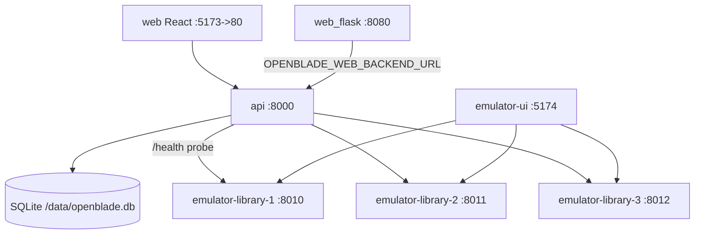

# Service Map

## Dependencies (verified)
- `web`/`web_flask`/`cli` → `api` (HTTP). `api` → `catalog` (SQLite) and the active backend.
- `api` → `emulator` fleet only via HTTP `/health` probe + AML calls (`OPENBLADE_EMULATOR_URLS`).
- No message broker, cache, or search service. Jobs run in-process.

See [deployment topology](deployment-topology.md) and [components/api](../components/api.md).
