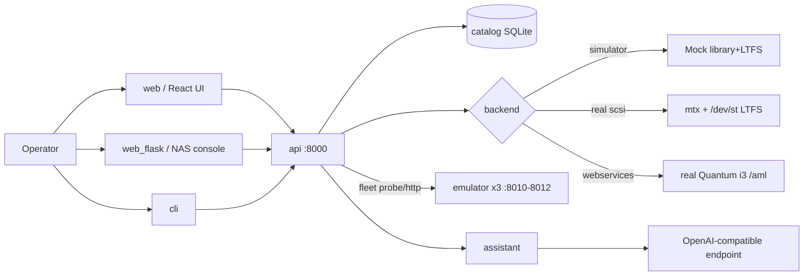

# System Context

## Actors
- **Operator** (human): archive/restore, library management, NAS config.
- **AI ops agent** (automated): read-only diagnostics + gated remediation (see [agent](../agent/operating-model.md)).
- **External systems**: an OpenAI-compatible LLM endpoint (assistant, optional); a real Quantum i3 (webservices/scsi backends, optional).

## Sensitive assets
- Tape data + LTFS filesystems (data path). Catalog metadata. Auth credentials/sessions.
  Real-hardware control (destructive). See [trust boundaries](trust-boundaries.md).

## Operational dependencies
- SQLite catalog file; the selected backend; (for fleet) reachable emulator URLs;
  (for assistant) the configured LLM endpoint.
