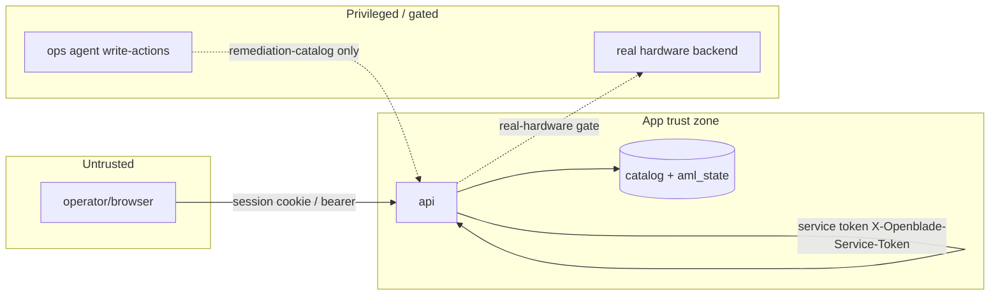

# Trust Boundaries

## Boundaries (verified)
1. **Auth boundary**: `/aml`+native mutating routes require `require_auth` (session cookie `sessionID` or bearer). Login `POST /aml/users/login`.
2. **Service-token boundary**: physically-actuating endpoints (mount/unmount/move/unload) also require `X-Openblade-Service-Token` (`service_auth.py`) — controller-only.
3. **Real-hardware boundary**: `real` ops need `OPENBLADE_BACKEND=real` + `OPENBLADE_REAL_HARDWARE_ENABLED=true`. The agent is **denied** crossing this.
4. **Scope boundary**: `OPENBLADE_SCALAR_API_ONLY=true` hides native surfaces (emulator-only).
5. **CI merge boundary** (verified, notable): `auto-merge-trusted.yml` squash-merges PRs from `Amantux`/`Copilot` after CI — a supply-chain trust decision, not the ops agent.

## Sensitive assets behind boundaries
Tape data / LTFS; catalog; credentials & sessions (in-memory); LLM API key (assistant).
